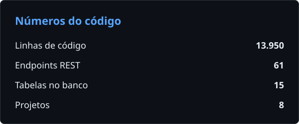
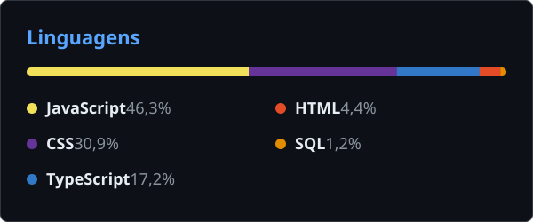
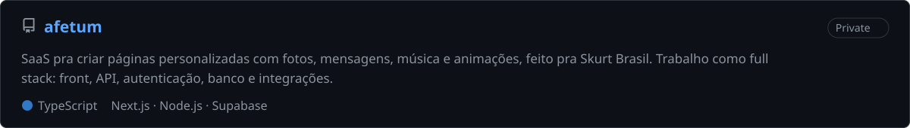
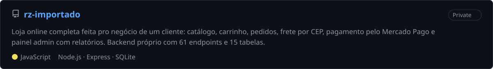
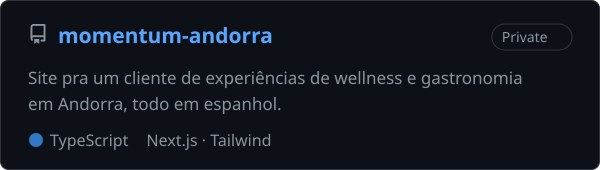
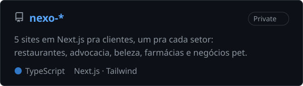

### Oi, eu sou o Julio 👋

Sou dev full stack. Gosto de pegar o projeto inteiro: modelar o banco, escrever a API, montar o front e colocar no ar.

Meu projeto principal é a **[Afetum](https://afetum.com)**, um SaaS da Skurt Brasil onde trabalho como full stack.

Fora isso, faço projetos pra clientes. O maior é a **RZ Importados**, uma loja online completa feita pro negócio de um cliente, com backend próprio, pagamento pelo Mercado Pago e frete por CEP. Também fiz sites em Next.js pra negócios na Espanha e em Andorra.

Falo português e espanhol, então faço projeto nas duas línguas.

 

 

### Projeto principal

### Projetos para clientes

